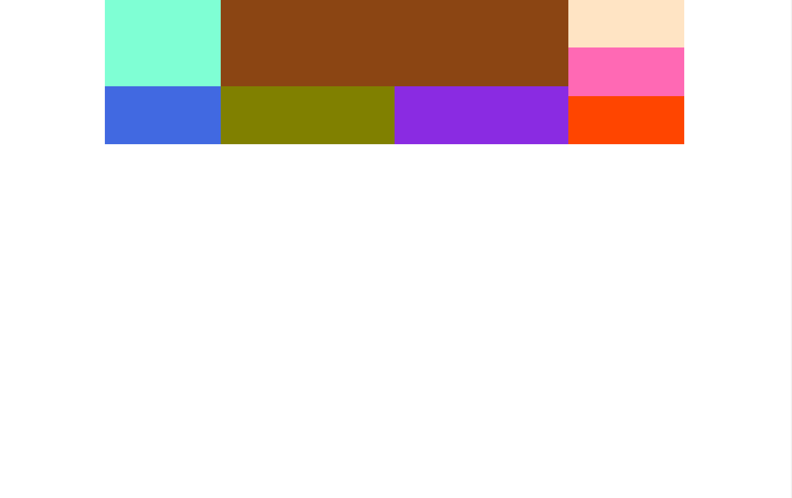

# Изучить материал

* https://developer.mozilla.org/ru/docs/Web/CSS/background
* https://developer.mozilla.org/ru/docs/Web/CSS/background-color
* https://developer.mozilla.org/ru/docs/Web/CSS/background-image
* https://developer.mozilla.org/ru/docs/Web/CSS/background-repeat
* https://developer.mozilla.org/ru/docs/Web/CSS/background-position
* https://developer.mozilla.org/ru/docs/Web/CSS/background-size
* https://developer.mozilla.org/ru/docs/Web/CSS/background-attachment

* https://developer.mozilla.org/ru/docs/Web/CSS/overflow
* https://css-tricks.com/almanac/properties/o/overflow/

* https://developer.mozilla.org/ru/docs/Web/CSS/opacity

# Практика
1) http://joxi.ru/Dr8kzMLFzwVxOA сверстать   фрагмент(цвет, картинки, текст свои, отступы - приблизительно, но одинаковые). 
2) Доп задание: верстаем 
(делать не обязательно)