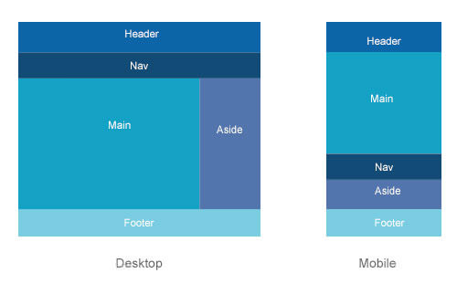

# Изучить материал
* https://html5book.ru/css-grid/
* https://www.youtube.com/watch?v=-fDqBEjfzGo
* https://css-live.ru/articles/kak-rabotaet-funkciya-minmax.html
* https://tuhub.ru/posts/css-grid-complete-guide
* https://html5book.ru/css3-mediazaprosy/#part5

# Практика
 * Сверстать макет - 1(ПК, Моб): 
 
 * весь макет должен быть в 100% экрана.
 * отзывчивость делать при помощи  
 `@media(min-width: 1100px]){
Стили этого запроса будут применяться для всех устройств при ширине области просмотра от 1100px. 
}`
